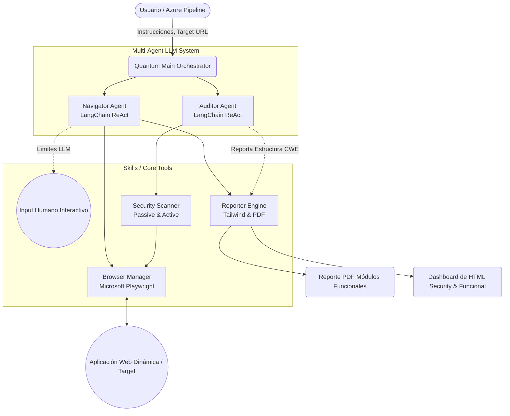

# Quantum QE Agent: Resumen Ejecutivo y Arquitectura

## 1. Resumen de Desarrollo y Capacidades del Agente
El Quantum QE Agent es un sistema multi-agente autónomo (basado en Inteligencia Artificial y LLMs) diseñado para realizar pruebas funcionales de regresión y auditorías de seguridad (AppSec) de forma completamente automatizada interactuando como un ser humano sobre aplicaciones web dinámicas y modernas.

### Capacidades Principales:
*   **Agente Navegador (Functional Testing):**
    *   **Navegación Autónoma:** Comprensión de interfaces gráficas (UI) complejas mediante la simplificación de estructuras pesadas del DOM.
    *   **Interacciones Robustas:** Clics en elementos dinámicos o escondidos. Si la herramienta estándar (Playwright) falla por capas o estilos CSS bloqueando el elemento, el sistema activa automáticamente un *fallback* a nivel de inyección JavaScript para asegurar la interacción de los botones y formularios.
    *   **Human-in-the-Loop (`ask_human`):** El agente tiene capacidad instrospectiva de detectar "callejones sin salida". Si una instrucción del usuario es ambigua o se topa con un captcha/error desconocido, detiene la ejecución asíncrona de la prueba y pregunta en la consola para tomar instrucciones precisas del humano de forma en tiempo real.
*   **Agente Auditor (Security AppSec):**
    *   **Análisis Pasivo (Análisis de Tráfico):** Interceptación de tráfico de red a nivel Chromium. Evalúa dinámicamente cabeceras de seguridad fundamentales (`HSTS`, `Content-Security-Policy (CSP)`, `X-Frame-Options`, `X-Content-Type-Options`, `Referrer-Policy`) y detecta deficiencias o flags faltantes en Cookies críticas (`Secure`, `HttpOnly`, y políticas `SameSite`).
    *   **Escaneo Activo Avanzado (Fuzzing):** Inyección de payloads y *probing* automatizado dentro de áreas funcionales de la app web (formularios de login, inputs de mensajes, textareas). Detecta susceptibilidad a vulnerabilidades OWASP críticas en tiempo real como XSS (Cross-Site Scripting Reflejado) y SQL Injection al rastrear cómo el sistema objetivo interpreta vectores de ataques.
    *   **Mapeo Estándar Industrial:** Cada vulnerabilidad expuesta es acompañada de una calificación de severidad, mitigación recomendada y catalogada rigurosamente con su respectivo código **CWE (Common Weakness Enumeration)** asociado a base de datos de amenazas comunes.
*   **Sistema de Reportería de Grado Empresarial:**
    *   **Reportes PDF Inmutables:** Documentación paso a paso que incluye timestamps para fines de auditoría técnica con capturas de pantallazo reales (screenshots) visualizando lo que ocurrió como evidencia legal en la prueba funcional.
    *   **Dashboards HTML Dinámicos:** Interface renderizada con **Tailwind CSS**, permitiendo interactuar con visualizaciones de datos estéticos desarrollados con **Chart.js**. El dashboard integra indicadores críticos como "Functional Pass Rate", separación gráfica estricta entre hallazgos pasivos y activos, y la distribución porcentual de severidades (Críticas y Altas), todo trazado y sin sobre-escribirse guardándose históricamente por fecha y hora.

## 2. Configuración, Arquitectura y Mejores Prácticas

La evolución del script inicial se transformó en una arquitectura modular empresarial bautizada como "Quantum QE Core", basada netamente en delegación de tareas y Single Responsibility Principle.

### 2.1 Tecnologías, Lenguajes y Frameworks (Stack Detallado)
*   **Python 3.10+ (Asíncrono):** Lenguaje principal. Se aprovecha intensivamente `asyncio` para garantizar llamadas no bloqueantes (vitales para interactuar con navegadores headless y hacer peticiones I/O a la API del LLM en paralelo sin colgar el hilo principal de Windows).
*   **Microsoft Playwright (Python API):** Framework de automatización web. Permite interactuar directamente con el DOM de las aplicaciones, interceptar tráfico de red (`page.on("response")` para Security Headers) y eludir protecciones anti-bot de las aplicaciones modernas gracias a su control profundo de Chromium.
*   **LangChain & LangGraph:** Frameworks de orquestación de LLMs. Proveen las primitivas para que el modelo razone (Memory, Prompts, Tools) y definen flujos de trabajo cíclicos.
*   **ReportLab & Jinja2/f-strings:** Tipografía para PDF inmutables y generación nativa de HTML emparejados con **Tailwind CSS** y **Chart.js** (vía CDN) para paneles estéticos de reporte cero dependencias.
*   **BeautifulSoup4:** Utilizado por debajo de las interacciones nativas para parsear rápidamente árboles de DOM inmensos y resumirlos en textos digeribles por la ventana contextual limitada del LLM.

### 2.2 Arquitectura Multi-Agente con LangGraph
El núcleo cognitivo no es un solo "script gigante", sino múltiples agentes especializados definidos como nodos dentro de un **Grafo Dirigido Acíclico (DAG)** usando LangGraph. Esto representa el estado del arte en sistemas cognitivos autónomos:
1.  **Orquestador Central (`quantum_main.py`):** Actúa como el supervisor del ciclo de vida. Recibe las instrucciones del usuario, levanta el entorno del navegador y despacha condicionalmente el trabajo secuencial a los agentes.
2.  **Nodo: Agente Navegador (Functional ReAct):** Este agente entra en un ciclo LangGraph (Pensamiento -> Acción -> Observación). Su función exclusiva es "Navegar, Hacer Click, Escribir y Validar UI". Si falla, reintenta herramientas especializadas o invoca a un humano.
3.  **Nodo: Agente Auditor (Security ReAct):** Un agente completamente diferente parametrizado con una "mentalidad ofensiva". Una vez que el navegador está en un estado específico de la página, el orquestador pasa el control a este nodo para correr los Scanners.
Interacción: Estos agentes no compiten; cada uno tiene acceso transaccional al mismo contexto abstracto de Playwright a través de un `BrowserManager` inyectado como dependencia, garantizando el *Single Responsibility Principle*.

### Estructuración de Desarrollo:
*   `quantum_main.py`: Orquestador principal asíncrono que delega el estado de testeo global, fase funcional y después (opcionalmente) lanza auditorías de app-security. Implementa control inteligente desde consola para omitir las pruebas de seguridad en base a heurísticas (`--skip-security`).
*   **Modulos y Paquetes (`quantum_qe_core`):**
    *   `agents/`: Donde viven los razonadores abstractos del LLM (`navigator.py` y `auditor.py`).
    *   `skills/`: Componentes duros "agnósticos del LLM" que realizan lógica técnica determinista como el Fuzzing (`scanner.py`), Físicas del navegador local (`browser.py`) y Formateos (`reporter.py`).
*   **Seguridad del Agente:** Control integrado a través variables seguras de `.env` descartando que de manera inadvertida un *leak* comparta las credenciales de LangChain, OpenAi o del entorno a repositorios vía correcta integración de exclusión mediante `.gitignore`.
*   **Gestión de Dependencias:** Entorno de ejecución determinístico facilitando los requerimientos unificados mediante un `requirements.txt`.

### 2.3 Capacidades del Motor RAG (Retrieval-Augmented Generation)
El Quantum QE Agent integra un motor **RAG** encapsulado en el módulo de su conocimiento.
*   **Fundamento:** Los LLMs tienen conocimientos vagos y a veces desactualizados. El RAG provee "verdad absoluta" directamente inyectada al contexto.
*   **Módulo Knowledge (`knowledge.py`):** El bot posee archivos locales de conocimiento curado y políticas (ej. la base de datos `owasp_top_10.md` introducida en su entorno).
*   **Generación Aumentada Estricta:** Durante la auditoría, cuando el `Security Scanner` encuentra un vector sospechoso, el Agente Auditor invoca la herramienta `SearchSecurityStandards`. Esta herramienta hace una búsqueda en los documentos de estándares OWASP y retorna la política oficial, el identificador **CWE** estandarizado y sugerencias de remediación industrial exactas. 
*   **Cero Alucinaciones:** Permite anclar y reportar deficiencias de seguridad explícitas y reales (estándares de la industria) enriquecidas en la memoria de trabajo en vez de permitir que el LLM proponga fixes genéricos o inciertos probables a alucinar.

## 3. Diagrama Topológico de la Arquitectura de Decisión

## 4. Estrategia de Modernización: Operación Nube en Microsoft Azure

Hacer este producto Enterprise-ready facilita integrarlo a metodologías modernas de *Shift-Left Testing* utilizando la nube de **Microsoft Azure**, operándolo directamente no desde un portátil de un desarrollador, si no inyectándolo globalmente a toda liberación de productos de software.  

El Quantum QE Core es capaz de ser empaquetado y subido de forma natural como contenedor Docker en la nube, aportando los siguientes beneficios:

### 1. Azure Pipeline Integrations (Azure DevOps)
En lugar que usted corra la terminal a mano, Azure DevOps puede incluir una tarea extra ("Task") a sus CI/CD Pipelines donde, previo a mandar la app web a Producción (justo en la fase Staging o Pruebas de Integración (UAT)), Azure dispara la imagen Docker del Agente. Este evalua que no se rompió código del cliente y verifica las cabeceras de seguridad. *Si la calificación arroja severidad de seguridad Nivel Crítica o Falla un caso de uso (botón de login no sirve), Quantum hace fallar deliberadamente el Pipeline garantizando la calidad y cancelando el Deploy.* 

### 2. Contenedores Efímeros: Azure Container Instances (ACI) o AKS
El entorno asíncrono y la gestión de Chromium pesada subyacente la maneja perfecta ACI. Simplemente levanta el agente a alta escalabilidad una vez para cada build (Ejecución Serverless) optimizando y reduciendo masivamente los costos. Si la organización tiene docenas de equipos, **Azure Kubernetes Service (AKS)** escalará horizontalmente docenas de agentes probando diferentes web applications en paralelo simulando tests masivos simultáneamente.

### 3. Resguardos e Identidades: Azure Key Vault
El control de la inteligencia `OPENAI_API_KEY`, keys de trazabilidad como `LangSmith`, o incluso si el agente debe probar interfaces logeándose con nombres de usuario/passwords corporativos (Ejemplo de las instrucciones), jamás se colocarán expuestos en CLI ni git. El contenedor del Agente le consultará en tiempo de ejecución de manera cifrada las llaves privadas o secrets a los recursos de *Azure Key Vault*.

### 4. Publicación Histórica: Azure Blob Storage Static Websites
La lógica que usted programó donde Quantum lanza un historial sin sobre-escribirse de los Dashboards (`report_TIMESTAMP.html`) se sincronizará para escribir los ficheros terminados a un Storage Account optimizado que hospede archivos estáticos con *Azure Blob Storage*. Todos sus QA y desarrolladores en Azure podrán accesar a la URL pública del dashboard del Storage para visualizar hermosas métricas funcionales de todas las ejecuciones sin la tediosidad de compartir correos. 

### 5. Telemetría y Salud (Azure Monitor Labs)
Debido a la naturaleza asíncrona de Quantum QE Agent, integrarlo a Azure Monitor u *Log Analytics Workspaces* servirá de *Audit Trail* para trazar por cuanto tiempo Fuzzean los servidores sus herramientas nativas de escaneo o cuando falla la resolución DNS de un sitio y provee visibilidad de costos totales invertidos sobre interacciones de Tokens LLM a nivel organizacional.

## 5. Alineación con el Estándar de Calidad ISO/IEC 25010

El sistema garantiza que no sólo descubre bugs en software, sino que fue diseñado como plataforma cumpliendo rigurosamente los dominios del modelo de calidad de producto **ISO/IEC 25010**:

1.  **Adecuación Funcional (Functional Suitability):** El sistema RAG junto a las herramientas de análisis pasivo se asegura de la exactitud (Accuracy) al reportar vulnerabilidades basales (CWE correctos) e incorpora completitud probando las funciones End-to-End solicitadas mediante la navegación autónoma.
2.  **Eficiencia de Desempeño (Performance Efficiency):** Lograda empíricamente al operar bajo operaciones asíncronas de Python (`ainvoke`, `asyncio`). El agente no bloquea recursos durante el *Fuzzing* o captura de tráfico en Chromium; usa eficientemente las capacidades del procesador local o de la instancia efímera en la nube (ACI en Azure).
3.  **Usabilidad (Usability):** Contemplada al desarrollar una arquitectura modular que expone parámetros CLI amigables (`--url`, `--skip-security`), y un mecanismo proactivo de `Human in the Loop`, empoderando la operabilidad para que un ingeniero QA o DevSecOps intervenga directamente desde consola si el agente detecta barreras ambiguas o solicita inputs confidenciales.
4.  **Fiabilidad (Reliability):** Tolerancia a fallos reforzada con el sistema de *fallback*. Si el clic nativo asíncrono manejado por LangGraph en conjunto con Playwright falla (por capas CSS superpuestas), el sistema captura el timeout y procede de forma autónoma con una inyección JS directa de evento Click como un sólido plan de tolerancia a errores, manteniendo una trazabilidad inmutable de la evidencia.
5.  **Seguridad (Security):** Todo token de API sensible (Modelos Fundacionales, Entornos de Staging) está estrictamente gobernado y mitigado vía Key Vaults o archivos `.env`, descartando inyecciones y exposiciones en la capa de código.
6.  **Mantenibilidad (Maintainability):** Código estructurado como **Clean Architecture** y regido por principios **SOLID** (Sección de *Skills* vs *Agents*). Los analizadores determinísticos ("Skills") operan independientemente de los orquestadores estocásticos ("Agents"), probando así altas dosis de modificabilidad y permitiendo adaptar reportadores PDF a HTML interactivos sin corromper la lógica en el núcleo cognitivo.
7.  **Portabilidad (Portability):** Agnóstico del Sistema Operativo por el poder de Python y la emulación de Playwright. Completamente preparado y nativo para ser distribuido o contenedorizado sin problemas de dependencias subyacentes hostiles.
